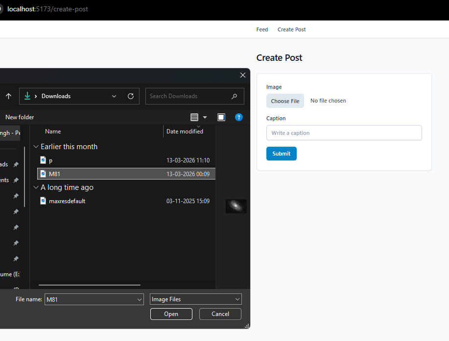
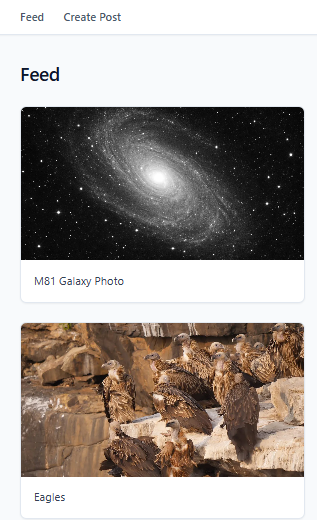
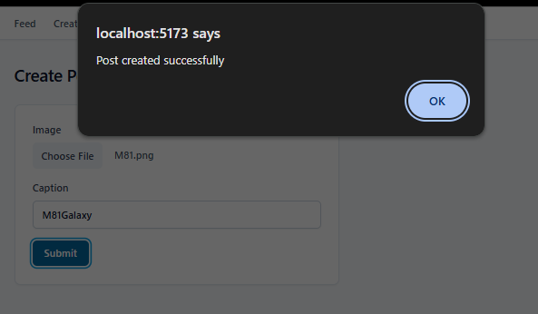

# 📸 PostHub – Full Stack Image Posting Platform

PostHub is a full-stack web application that allows users to upload images with captions and view them in a dynamic feed. The project demonstrates real-world full-stack development including RESTful APIs, file handling with Multer, and cloud-based image storage using ImageKit.

---

## Features

* Upload posts with images and captions
* View all posts in a dynamic feed
* Image upload using ImageKit
* REST API integration between frontend and backend
* Clean separation of frontend and backend architecture

---

## Tech Stack

### Frontend

* React (Vite)
* Tailwind CSS
* Axios
* React Router

### Backend

* Node.js
* Express.js
* MongoDB (Mongoose)

### Other Tools

* Multer (file handling)
* ImageKit (cloud image storage)

---

## Project Structure

```
complete Backend/
│
├── ffrontend/   # React frontend
├── bbackend/    # Node + Express backend
```

---

##  How to Run Locally

### 1️⃣ Clone the repository

```
git clone https://github.com/rohansingh-21/Posthub.git
```

---

### 2️⃣ Backend Setup

```
cd bbackend
npm install
```

Create a `.env` file inside `bbackend`:

```
Mongoose_string=your_mongodb_connection_string
ImageKit_Public_key=your_imagekit_public_key
ImageKit_Private_key=your_imagekit_private_key
```

Start backend:

```
npm start
```

---

### 3️⃣ Frontend Setup

```
cd ffrontend
npm install
npm run dev
```

Open browser:

```
http://localhost:5173
```

---

##  API Endpoints

| Method | Endpoint       | Description                         |
| ------ | -------------- | ----------------------------------- |
| GET    | `/posts`       | Fetch all posts                     |
| POST   | `/create-post` | Create a new post (image + caption) |

---

##  Screenshots
### Create Post


### Feed Page


### Upload Success



---

##  Future Improvements

* Add authentication (login/signup)
* Edit and delete posts
* Like and comment system
* Improved UI/UX with Tailwind
* Pagination and search
* Deployment (frontend + backend)

---

##  Author

Rohan Singh
GitHub: https://github.com/rohansingh-21
